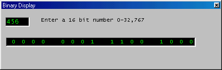



## binary display

### Description

This is a pretty simple program that displays a 16-bit value (0-32767) in binary form. I am learning assembly so I thought this program would be cool. who knows it maybe helpful for someone learning computer science, assembly, etc ;P
 
### More Info
 

             |
---                |---
**Submitted On**   |2001-11-26 12:15:48
**By**             |[Andres Tremols](https://github.com/Planet-Source-Code/PSCIndex/blob/master/ByAuthor/andres-tremols.md)
**Level**          |Intermediate
**User Rating**    |3.7 (11 globes from 3 users)
**Compatibility**  |VB 6\.0
**Category**       |[Miscellaneous](https://github.com/Planet-Source-Code/PSCIndex/blob/master/ByCategory/miscellaneous__1-1.md)
**World**          |[Visual Basic](https://github.com/Planet-Source-Code/PSCIndex/blob/master/ByWorld/visual-basic.md)
**Archive File**   |[binary\_dis3785111272001\.zip](https://github.com/Planet-Source-Code/andres-tremols-binary-display__1-29259/archive/master.zip)

